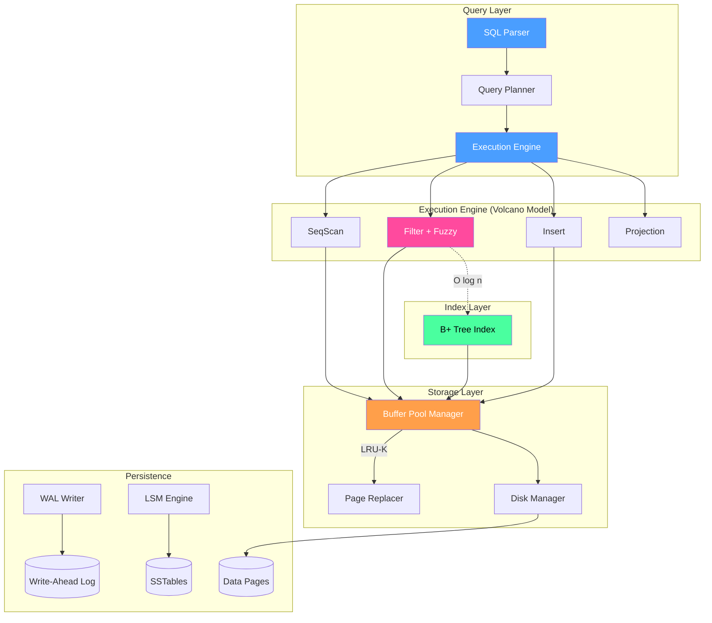

# MyDB - High-Performance Relational Database Engine

[]()
[]()
[](LICENSE)

**MyDB** is a high-performance, persistent database engine built with **modern C++ (C++20)**. It combines an **LSM-Tree key-value store** with a **relational query engine**, featuring advanced capabilities like **fuzzy string matching** and **data veracity scoring**.

> This project was developed as a portfolio piece aligned with the **Ghent University (UGent)** Computer Science curriculum and the **DDCM Research Group** focus on fuzzy databases and data quality.

## 🌟 Key Features

### Core Engine
- **LSM-Tree Storage**: Fast writes with efficient sorted storage
- **Buffer Pool Manager**: Page caching with LRU-K replacement policy
- **B+ Tree Indexing**: O(log n) lookups and range scans
- **Write-Ahead Logging**: ACID durability guarantees

### Relational Layer
- **SQL-like Query Language**: INSERT, SELECT, DELETE, CREATE TABLE
- **Volcano Execution Model**: Iterator-based query processing
- **Schema & Catalog**: First-class table and column definitions

### Research-Aligned Features
- **🔍 Fuzzy String Matching**: Levenshtein and Jaro-Winkler for approximate queries
- **📊 Data Veracity Scoring**: Track confidence/quality of each record
- **Time Travel (MVCC)**: Query data at any historical point

### Developer Experience
- **TUI Dashboard**: Monitor and manage via terminal UI
- **Embedded Python**: Execute stored procedures
- **Cross-Platform**: Windows (IOCP) and Linux (io_uring)

---

## 🏗️ Architecture



---

## 🔬 Research Alignment (UGent DDCM)

This project implements concepts from the **Database, Document, and Content Management (DDCM)** research group at Ghent University, particularly work by **Prof. Guy De Tré** on:

### Fuzzy Databases
```sql
-- Standard SQL can't handle typos or variations
SELECT * FROM students WHERE name = 'Jon';  -- Misses "John", "Jonathan"

-- MyDB's fuzzy matching finds similar names
SELECT * FROM students WHERE name FUZZY LIKE 'Jon' WITH THRESHOLD 0.8;
-- Returns: Jon, John, Jonas, Jonathan (all with similarity >= 0.8)
```

Algorithms implemented:
- **Levenshtein Distance**: Edit distance (insertions, deletions, substitutions)
- **Jaro-Winkler Similarity**: Optimized for short strings like names

### Data Veracity (Big Data's 5th V)
```sql
-- Insert data with confidence score
INSERT INTO sensor_data (id, value) VALUES ('temp_01', 23.5) VERACITY 0.95;

-- Query only high-confidence data
SELECT * FROM sensor_data WHERE __veracity__ > 0.9;

-- Aggregate quality metrics
SELECT location, AVG(value), MIN(__veracity__) 
FROM sensor_data GROUP BY location;
```

---

## 🛠️ Build & Run

### Requirements
- CMake 3.20+
- C++20 Compiler (MSVC 2022, GCC 11+, or Clang 14+)

### Build
```bash
mkdir build && cd build
cmake -DMYDB_BUILD_TESTS=ON ..
cmake --build . --config Release
```

### Run Tests
```bash
ctest --output-on-failure
```

### Run Server
```bash
./Release/mydb_server.exe
```

### Run Dashboard
```bash
./Release/mydb_dashboard.exe
```

---

## 📚 Usage

### CLI Client
```bash
./Release/mydb_shell.exe

# Key-Value Operations
mydb> PUT user:101 "Alice"
mydb> GET user:101
mydb> GET user:101 AS OF 1704067200  # Time travel

# SQL Operations
mydb> CREATE TABLE students (id INTEGER, name VARCHAR(50), age INTEGER);
mydb> INSERT INTO students VALUES (1, 'Alice', 22);
mydb> INSERT INTO students VALUES (2, 'Jon', 21) VERACITY 0.9;
mydb> SELECT * FROM students WHERE name FUZZY LIKE 'John' WITH THRESHOLD 0.7;
```

---

## 📁 Project Structure

```
MyDB/
├── include/mydb/
│   ├── storage/           # Buffer Pool, Disk Manager, Page
│   │   ├── buffer_pool.hpp
│   │   ├── disk_manager.hpp
│   │   ├── lru_k_replacer.hpp
│   │   └── page.hpp
│   ├── catalog/           # Schema, Tuple, Catalog
│   │   ├── catalog.hpp
│   │   ├── schema.hpp
│   │   ├── tuple.hpp      # Includes veracity scoring
│   │   └── value.hpp
│   ├── execution/         # Volcano Model Executors
│   │   ├── executor.hpp
│   │   ├── seq_scan_executor.hpp
│   │   ├── filter_executor.hpp
│   │   ├── insert_executor.hpp
│   │   └── expression.hpp  # Includes FuzzyLikeExpression
│   ├── index/             # B+ Tree Implementation
│   │   └── bplus_tree.hpp
│   ├── util/              # Utilities
│   │   └── similarity.hpp  # Levenshtein, Jaro-Winkler
│   └── engine/            # LSM-Tree Engine
│       ├── memtable.hpp
│       ├── sstable.hpp
│       └── wal.hpp
├── src/                   # Implementation files
├── tests/                 # Unit tests (Google Test)
│   ├── test_similarity.cpp
│   ├── test_buffer_pool.cpp
│   └── ...
└── tools/                 # CLI and utilities
```

---

## 🎓 Curriculum Mapping

| Component | UGent Course | Competency Demonstrated |
|-----------|--------------|------------------------|
| Buffer Pool Manager | Besturingssystemen | Memory hierarchy, page replacement |
| B+ Tree Index | Algoritmen en Datastructuren | Tree data structures, O(log n) complexity |
| Volcano Executor | Databases | Query processing, iterator model |
| LRU-K Replacer | Parallel Computer Systems | Caching algorithms, thread safety |
| Fuzzy Matching | DDCM Research Topics | Soft computing, approximate algorithms |
| Veracity Scoring | Big Data Technology | Data quality, metadata management |
| C++20 Codebase | Objectgericht Programmeren | Modern C++, RAII, templates |

---

## 📄 License

MIT License - See [LICENSE](LICENSE) for details.

---

## 🙏 Acknowledgments

- **Ghent University** - Computer Science curriculum inspiration
- **DDCM Research Group** - Fuzzy database concepts
- **CMU 15-445** - Database systems course structure
- **Andy Pavlo** - Educational database materials
